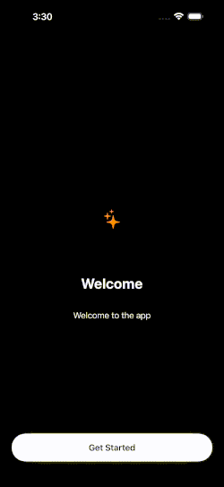

# Onboarding_Basic

A basic SwiftUI Onboarding SDK designed to provide a first-impression for users. It features smooth animations, haptic feedback, and a built-in logic for App Store review requests.



---

## Features

- **📱 Multi-Screen Flow**: Easily pass an array of items to create a step-by-step tutorial.

- **📳 Haptic Feedback**: Built-in UIImpactFeedbackGenerator for a premium tactile feel.

- **⭐️ Review Request**: Automatically triggers SKStoreReviewController on the final step.

- **💾 Persistent State**: Automatically saves the "onboarding completed" status to UserDefaults using a custom suite.

- **⌛️ Loading States**: Includes a LoadingView overlay to manage transitions during the review request process.
  
- **✨ Dark Mode Ready**: A high-contrast UI optimized for dark mode.

---

## Installation
Swift Package Manager
In Xcode, go to File → Add Packages...

Enter the repository URL: [https://github.com/FallikTheCat/BKCustomComponentsKit](https://github.com/FallikTheCat/BKOnboarding_Basic)

Select Up to Next Major Version and click Add Package.

---

## Usage Example

```swift
BKOnboardingView(
    onboardingItems: [
        .init(imageName: "sparkles", title: "Welcome", description: "Welcome to the app"),
        .init(imageName: "info.circle", title: "What is the App?", description: "*App Description & Features*"),
        .init(imageName: "lightbulb.fill", title: "How to Use", description: "*App Tutorial & Tips*"),
        .init(imageName: "star.fill", title: "Rating", description: "Rate the App"),
    ],
    onboardingShown: $onboardingShown
)
```
